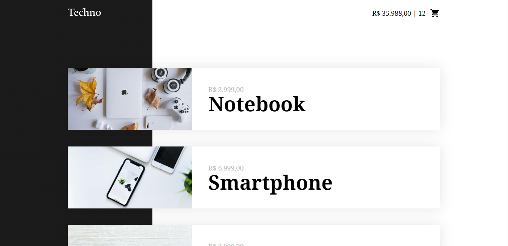
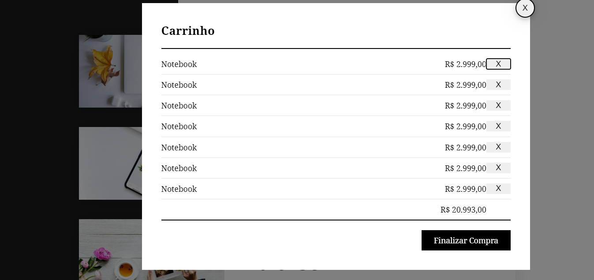
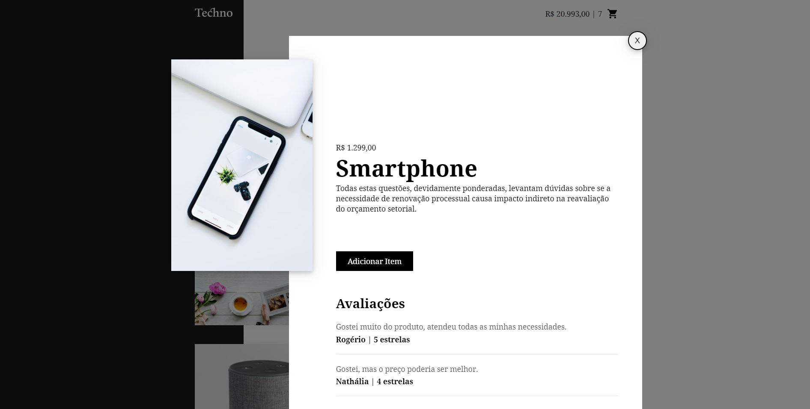

# TECHNO-VUE

## Projeto básico de VueJS utilizando conceitos básicos. Curso Origamid

No projeto foi desenvolvida uma simples loja virtual para aplicar conhecimentos como methods, watch, life cycle e outros. 

```
# Instalação
> npm install
```




